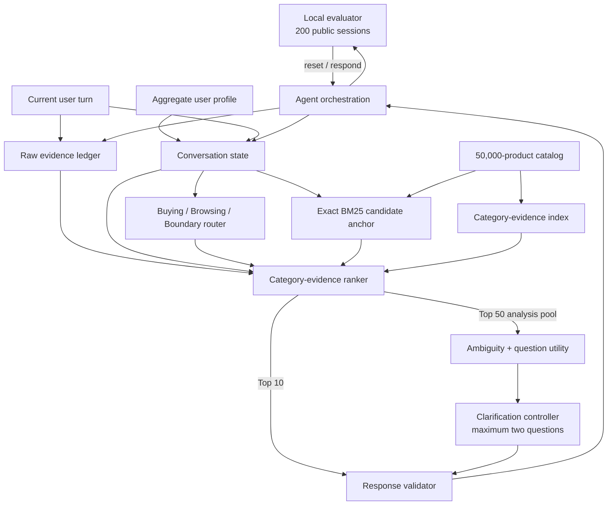

# TechJam2026-ShoppingCopilot

A deterministic, multi-turn shopping agent, 'Your Shopping Bestie' that searches a frozen catalog of
50,000 Amazon products and returns the ten most likely `parent_asin` values.
The agent remembers active preferences, handles changed intent and rejected
recommendations, and asks a useful clarification question when another answer
is expected to improve retrieval.

The final P5 configuration reaches a **0.733983 TechnicalScore** and **0.870
HitRate@10** on the 200-session public development set. It uses no hosted model,
makes no API calls, and reports zero model-token usage.

> [!NOTE]
> These are public development-set results, not a claim about the organizer's
> private 800-session set. The exact final result was reproduced twice and is
> preserved in the repository's result artifacts.

## Final results

| Metric | Final P5 | Exact BM25 baseline |
| --- | ---: | ---: |
| HitRate@10 | **0.870000** | 0.125000 |
| Mean reciprocal rank | **0.519609** | 0.068034 |
| Mean turns to conversion | **3.845** | 9.810 |
| Efficiency | **0.7155** | 0.1190 |
| TechnicalScore | **0.733983** | 0.106710 |

The final score is calculated as:

```text
Efficiency = clip((11 - MTTC) / 10, 0, 1)
TechnicalScore = 0.50 * HitRate@10 + 0.30 * MRR + 0.20 * Efficiency
```

Scenario performance on the public set:

| Scenario | Sessions | HR@10 | MRR | MTTC |
| --- | ---: | ---: | ---: | ---: |
| Buying | 80 | 0.9375 | 0.508983 | 2.825 |
| Browsing | 80 | 0.9500 | 0.610233 | 3.175 |
| Intent Override | 30 | 0.4667 | 0.329762 | 7.967 |
| Boundary | 10 | 0.9000 | 0.449167 | 5.000 |

See the [final comparison](techjam-conversational-search-participant-kit/docs/results/autonomous_optimization/final_comparison.json)
and the two frozen P5 runs
([run 1](techjam-conversational-search-participant-kit/docs/results/autonomous_optimization/p5_official_run1.json),
[run 2](techjam-conversational-search-participant-kit/docs/results/autonomous_optimization/p5_official_run2.json))
for the complete evidence.

## User guide

### 1. Set up the environment

Python 3.12 is recommended and is the version used for the latest local
verification.

```bash
cd techjam-conversational-search-participant-kit
python3.12 -m venv .venv
source .venv/bin/activate
python -m pip install --upgrade pip
python -m pip install -r requirements.txt
```

On Windows PowerShell, activate the environment with:

```powershell
.venv\Scripts\Activate.ps1
```

### 2. Provide the catalog

The public session file is included at `data/public_set.jsonl`. The competition
catalog is intentionally ignored by Git. Place the organizer-authorized file at:

```text
techjam-conversational-search-participant-kit/data/catalog.jsonl
```

The file must contain 50,000 non-empty JSONL records, each with a unique,
non-empty `parent_asin`. Validate it before running:

```bash
python -c "import json,pathlib; p=pathlib.Path('data/catalog.jsonl'); rows=[json.loads(x) for x in p.read_text(encoding='utf-8').splitlines() if x.strip()]; ids=[x.get('parent_asin') for x in rows]; assert len(rows)==50000 and all(ids) and len(set(ids))==50000; print('catalog valid:', len(rows))"
```

Data origin and redistribution notes are in
[`DATA_ATTRIBUTION.md`](techjam-conversational-search-participant-kit/DATA_ATTRIBUTION.md).

### 3. Try the agent interactively

```bash
python demo.py
```

Enter requests such as `I need black running shoes under $100`. Answer the
agent's clarification naturally, reject the current list with `Those options
are not quite right`, or test an override with `Actually, ignore that; I need a
blue rain jacket instead`. Enter `/quit` to end the demo.

The complete presenter walkthrough is in [`DEMO.md`](DEMO.md).

### 4. Reproduce the final score

Run this command from `techjam-conversational-search-participant-kit`:

```bash
python -m evaluator.local_evaluator \
  --catalog data/catalog.jsonl \
  --dataset data/public_set.jsonl \
  --retrieval-mode contextual \
  --contextual-policy contextual.category-evidence.v1 \
  --clarification-policy clarification.category-evidence-utility-buying.v1 \
  --dense-cache data/.dense-retrieval/catalog-minilm.npz \
  --output results.json
```

Expected quality metrics are `HR@10=0.87`, `MRR=0.519609`, `MTTC=3.845`, and
`TechnicalScore=0.733983`. Hardware-dependent runtime and memory figures will
vary. The non-timing determinism hashes should be:

```text
normalized response: 0b17cb2037fa6a18580e98b097b8268655d2121855ce8c9cf9f158d1b2a1e486
session outcome:      654dbb33898ec07a742b88c04129519faf82b3c032a0fa5b7f7888e5df24989e
```

### 5. Run the test suite

```bash
python -m unittest discover -s tests -v
```

The current repository passes 265 tests covering state isolation, intent
overrides, retrieval, clarification, deterministic ordering, failure fallbacks,
response validation, and evaluator integration.

## How the product works

The evaluator creates one `Agent`, calls `reset(session_id, user_profile)` at
the start of every shopping session, and then calls
`respond(session_id, user_message, turn, top_k)` for up to ten turns. Each
response contains:

```json
{
  "message": "What matters most to you when choosing?",
  "ask_attribute": "other",
  "recommendations": [
    {"parent_asin": "B074GDTLM6"}
  ],
  "usage": {
    "prompt_tokens": 0,
    "completion_tokens": 0
  }
}
```

Recommendations are ordered best to worst. The central validator removes
unknown or duplicate identifiers, enforces `top_k`, and preserves only valid
clarification attributes.

## Architecture



### Runtime components

| Component | Responsibility |
| --- | --- |
| Conversation state | Maintains category, price, style, color, material, use case, exclusions, and source/strength metadata. Current-turn evidence overrides history, which overrides profile hints. |
| Evidence ledger | Keeps current and historical raw messages separate. Generic rejection text is not treated as product evidence, and intent overrides archive rather than activate the old request. |
| BM25 anchor | Supplies deterministic lexical candidates from the visible catalog fields. On negative feedback it reuses the last informative request while excluding already rejected products. |
| Category-evidence index | Builds label-free category, phrase, rare-token, structured-constraint, popularity, and historical-evidence signals from the catalog. |
| Cohesive ranker | Scores at most 4,000 candidates, rewards independent supporting signals, penalizes contradictions, and applies stable ASIN tie-breaking. |
| Intent router | Classifies the observable turn as Buying, Browsing, Boundary, or Uncertain for policy gating. |
| Question utility | Estimates whether asking `other` or `feature` is answerable and likely to improve hit probability or reciprocal rank after paying a turn cost. |
| Clarification controller | Asks at most two non-repeated questions, tracks answers/declines, handles override interruption, and never asks on turn ten. |
| Response validator | Guarantees schema-valid, catalog-valid, unique output and a safe lexical fallback if an optional component fails. |

The promoted P5 path is entirely local and deterministic. Dense and hybrid
retrievers remain available for ablation, but the final policy sets dense weight
to zero because they did not improve the measured score.

## Difficulties faced

### Exact product identity is harder than semantic relevance

The evaluator awards a hit only when the hidden product's exact `parent_asin`
appears in the Top 10. A semantically reasonable substitute still scores as a
miss. Generic semantic retrieval therefore looked plausible to a person while
performing poorly on the actual objective.

**Resolution:** preserve exact lexical evidence, then combine category,
catalog-phrase, rare-token, structured-constraint, popularity, and conjunction
signals in a deterministic catalog-derived ranker.

### Generic feedback erased the useful query

After an unsuccessful turn the simulator can reply with generic rejection text.
Running BM25 over that text discards the shopper's last informative request at
the exact moment the system needs to rotate to new candidates.

**Resolution:** feedback-memory retrieval reuses the last informative request
only for recognized negative feedback and excludes the previously shown
products. This single change raised TechnicalScore from `0.117660` to
`0.305993`.

### Multi-turn intent can change without warning

Intent Override sessions make old preferences actively misleading. Clearing all
history loses useful identification evidence, while applying old preferences as
current constraints contradicts the shopper.

**Resolution:** keep current intent authoritative, clear rejected-product state
on override, and store historical evidence in a separate bounded channel with a
smaller weight.

### Asking a question costs a turn

Clarification is not automatically beneficial. Repeated, unanswerable, or late
questions increase MTTC and can reduce the final score even when they sound
helpful.

**Resolution:** analyze only the bounded candidate pool, model answerability,
rank questions by expected hit/rank benefit minus turn cost, cap each session at
two questions, and track answered, declined, pending, and interrupted states.

### Attractive experiments could still regress users

Dense retrieval, equal-weight hybrid fusion, signature heads, and unrestricted
questions all had reasonable hypotheses, but several reduced measured quality
or lost previously successful sessions.

**Resolution:** predeclare each experiment, use disjoint-target shadow suites,
compare outcomes per session, apply paired bootstrap confidence intervals, keep
explicit rollback policies, and promote only frozen configurations that pass
correctness and determinism gates.

### Reliability must survive imperfect components

Catalog metadata is sparse, model caches can be absent, and one bad optional
component must not invalidate a whole session.

**Resolution:** validate caches and policy fingerprints, treat missing metadata
as unknown rather than contradictory, isolate session state on every reset, and
fail back to validated BM25 recommendations. The final 200-session run reported
zero exceptions, invalid responses, invalid ASINs, duplicates, repeated
questions, or contract violations.

## Implementation path to a better score

The team improved the score through measured, reversible changes rather than a
single large rewrite:

| Stage | Main implementation | TechnicalScore |
| --- | --- | ---: |
| Exact BM25 | Stateless raw-turn lexical baseline | 0.106710 |
| Hardened contextual base | State, rotation, routing, dense Browsing tail, and safe clarification | 0.117660 |
| H0 feedback memory | Reuse the last informative request after generic rejection | 0.305993 |
| H3 override history | Add bounded, subordinate pre-override evidence | 0.331493 |
| P1 category evidence | Rank with category, phrase, rare-token, structured, popularity, history, and contradiction signals | 0.507985 |
| P2 question utility | Ask answerability-aware `other`/`feature` questions on Browsing and Boundary routes | 0.554435 |
| P5 causal confirmation | Extend the frozen question policy to eligible Buying turns and verify all downstream effects | **0.733983** |

The final P5 change gained 39 public-session hits and lost seven relative to P2,
for a net gain of 32. Its paired TechnicalScore delta was `+0.179548` with a
fully positive 95% bootstrap interval of `[0.129785253, 0.232346637]`. Two exact
official runs produced identical quality metrics and non-timing hashes.

Rejected experiments remain documented because they explain important design
decisions:

- Dense-only retrieval scored `0.019639` and fixed hybrid fusion scored
  `0.015881` in the historical Issue 2B ablation.
- H1 open-evidence questions improved the aggregate score but lost seven
  champion hits and had a confidence interval crossing zero.
- H2's unique catalog-signature head decreased MRR and was reverted.
- Confidence-based recommendation exposure failed its shadow gate and remained
  disabled.

Full experiment evidence is in
[`docs/autonomous_technicalscore_optimization.md`](techjam-conversational-search-participant-kit/docs/autonomous_technicalscore_optimization.md)
and
[`docs/results/autonomous_optimization/`](techjam-conversational-search-participant-kit/docs/results/autonomous_optimization/).

## Project layout

```text
.
├── README.md
├── DEMO.md
├── AmazonReviews2023-main/              # Upstream dataset utilities/reference
└── techjam-conversational-search-participant-kit/
    ├── demo.py                           # Interactive product demo
    ├── starter/                          # Agent, state, routing, ranking, questions
    ├── evaluator/                        # Local competition evaluator
    ├── dense_retrieval/                  # Optional MiniLM retriever and cache
    ├── benchmarks/                       # Ablations and regression diagnostics
    ├── config/                           # Fingerprinted policy registries
    ├── data/                             # Public set; local catalog goes here
    ├── docs/                             # Design, reproduction, and experiment evidence
    └── tests/                            # Deterministic unit/integration tests
```

## Limitations and next steps

- The final numbers are selected on the 200 public sessions and may not
  generalize to the private set.
- Intent Override remains the weakest scenario (`0.4667` HR@10) and is the most
  valuable target for future work.
- Slot extraction uses finite aliases and price patterns; novel paraphrases can
  be missed.
- Product explanations are not generated; the evaluator scores identifiers,
  not natural-language rationales.
- Building the in-memory category-evidence index adds startup time and hundreds
  of MiB of process memory.
- A clean clone still requires an authorized copy of the frozen catalog.

Promising next improvements are held-out paraphrase testing, stronger
override-safe evidence reconciliation, memory-efficient index serialization,
and a user-facing explanation layer that does not alter ranking.

## Further documentation

- [Competition specification](techjam-conversational-search-participant-kit/docs/competition_specification.md)
- [System architecture](techjam-conversational-search-participant-kit/docs/architecture.md)
- [Reproduction guide](techjam-conversational-search-participant-kit/docs/reproduction.md)
- [Agent API contract](techjam-conversational-search-participant-kit/docs/agent_api_contract.json)
- [Data policy](techjam-conversational-search-participant-kit/data/README.md)
- [Submission rules](techjam-conversational-search-participant-kit/docs/submission_rules.md)
