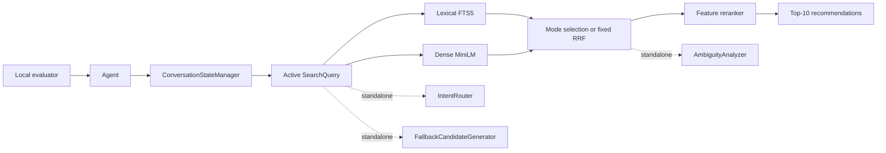

# TechJam Conversational E-Commerce Search

This project is a deterministic conversational product-search system for the
TechJam challenge. Given an anonymized shopper profile and a sequence of
messages, the agent maintains active preferences and returns up to ten Amazon
catalog `parent_asin` identifiers per turn. A session succeeds when the hidden
target appears in the Top 10 within ten turns.

The public development set has 200 sessions across Buying, Browsing, Intent
Override, and Boundary scenarios. The frozen catalog contains 50,000 products
from the Amazon Reviews 2023 `Clothing_Shoes_and_Jewelry` category. The
organizer's additional 800-session set is private and is not in this repository.

## Current implementation status

The evaluator-facing `Agent` currently uses structured conversation state,
supports lexical, dense, or fixed-hybrid retrieval, and feature-reranks the
bounded candidate pool. Several later-stage components exist as deterministic,
tested modules but are not yet connected to `Agent.respond`.

| Capability | Status on this branch |
| --- | --- |
| Structured conversation state and active query | Integrated |
| Field-aware lexical retrieval | Integrated; default mode |
| Dense retrieval and validated embedding cache | Integrated; optional mode |
| Fixed reciprocal-rank hybrid fusion | Integrated; optional mode |
| Hybrid dense-failure fallback to lexical | Integrated |
| Intent routing | Implemented and tested, not connected to retrieval policy |
| Boundary/empty-intent fallback candidates | Implemented and tested, not connected to `Agent` |
| Candidate-pool ambiguity analysis | Implemented and tested, not connected to `Agent` |
| Deterministic feature reranking | Integrated after every retrieval mode |
| User-facing clarification questions/history | Not implemented; `ask_attribute` is always `null` |

Consequently, the standalone routing, fallback, and ambiguity modules do not
affect the recorded evaluator results below. See
[`docs/architecture.md`](docs/architecture.md) for component contracts,
precedence rules, and the exact runtime path.

## Architecture at a glance



Every turn is parsed into active slots rather than appended to raw conversation
text. Current-turn values override conversation history, which overrides
profile-derived values. The agent then retrieves with the configured mode:

- **Lexical:** SQLite FTS5 candidate generation with field weights, structured
  filters, soft boosts, exclusions, and deterministic `parent_asin` ties.
- **Dense:** normalized `all-MiniLM-L6-v2` embeddings over deterministic catalog
  text, with cosine-equivalent dot-product ranking.
- **Hybrid:** lexical and dense candidates combined by weighted reciprocal-rank
  fusion: `lexical_weight / (rrf_k + lexical_rank) + dense_weight /
  (rrf_k + dense_rank)`.
- **Reranking:** a deterministic feature model scores up to 100 retrieved
  candidates using retrieval evidence plus active category, attribute, price,
  profile, hard-constraint, and exclusion signals before returning the Top 10.

Hybrid catches dense initialization/query failures and continues with lexical
candidates. Dense-only mode surfaces dense failures. This is different from the
standalone Boundary fallback generator, which is not yet in the runtime path.

## Setup

Python 3.10 or later is recommended. From this directory:

```bash
python -m venv .venv
```

Activate the environment:

```bash
# macOS/Linux
source .venv/bin/activate

# Windows PowerShell
.venv\Scripts\Activate.ps1
```

Install the dependency ranges and run the tests:

```bash
python -m pip install --upgrade pip
python -m pip install -r requirements.txt
python -m unittest discover -s tests -v
```

`numpy` and `sentence-transformers` are needed for dense/hybrid retrieval.
Lexical retrieval uses the Python standard library's SQLite build with FTS5.

## Official data acquisition

The repository intentionally commits only `data/public_set.jsonl` (200 labeled
development sessions). It does **not** commit the 50,000-product catalog, private
sessions, raw reviews, credentials, or API keys.

The intended distribution is a repository [GitHub Release](https://github.com/wenyiliangg/tiktok-future-employees/releases) containing
`catalog.jsonl.gz` and `SHA256SUMS`. As verified on **2026-08-29**, this
repository has no published release, so a fresh user cannot currently download
the official catalog from GitHub. Obtain the organizer-authorized frozen
catalog, or use the release when it is published, and do not substitute or
commit competition data.

1. Download both files from the repository's **Releases** page.
2. Compare the archive's SHA-256 digest with `SHA256SUMS`.
3. Decompress it to exactly `data/catalog.jsonl`.
4. Confirm that it has 50,000 non-empty JSONL rows and a `parent_asin` on every
   row.

Example checksum commands:

```bash
# macOS/Linux
sha256sum catalog.jsonl.gz

# Windows PowerShell
Get-FileHash catalog.jsonl.gz -Algorithm SHA256
```

Example cross-platform decompression from the repository directory:

```bash
python3 -m evaluator.local_evaluator --retrieval-mode lexical
python3 -m evaluator.local_evaluator --retrieval-mode dense
python3 -m evaluator.local_evaluator --retrieval-mode hybrid \
  --lexical-candidates 200 --dense-candidates 200 --final-candidates 10 \
  --lexical-weight 1.0 --dense-weight 1.0 --rrf-k 60
python3 -m evaluator.local_evaluator --retrieval-mode route-aware
```

`lexical` is the safe default. Dense and hybrid modes use
`data/.dense-retrieval/catalog-minilm.npz` unless `--dense-cache` supplies a
different compatible Issue 2A cache. Hybrid falls back to the improved lexical
retriever when dense initialization or retrieval fails.

`route-aware` composes the deterministic intent router with lexical, dense, and
Boundary fallback candidate generation. Route policies and diagnostics are
documented in [`docs/route_aware_retrieval.md`](docs/route_aware_retrieval.md).
It remains an explicitly selected experimental mode rather than the default.

Edit `starter/agent.py` to implement your system. Do not edit the evaluator or public labels when reporting your local score.
The command writes per-session results and aggregate metrics to `results.json`.

The standalone field-aware BM25 retriever, structured query contract, filtering
policies, and integration example are documented in
[`docs/lexical_retrieval.md`](docs/lexical_retrieval.md). It is intentionally not
wired into the evaluator-facing agent until conversation-state integration is
owned by the designated integrator.

The evaluator-facing agent also applies deterministic feature reranking to its
bounded retrieval pool. Feature definitions, weights, constraint policies,
diagnostics, and fallback behavior are documented in
[`docs/feature_reranking.md`](docs/feature_reranking.md).
The deterministic Boundary/empty-intent fallback generator, profile-evidence
adapter, diversity configuration, and Issue 2B-compatible candidate adapter are
documented in [`docs/fallback_candidates.md`](docs/fallback_candidates.md). The
generator is also intentionally route-agnostic and is not wired into the
evaluator-facing agent by this issue.

The included weak BM25 starter scores Hit Rate@10 `0.125`, MRR `0.068034`, and
MTTC `9.81` on the released public set. See `docs/baseline_results.json`.

## Agent Interface

```python
class Agent:
    def reset(self, session_id: str, user_profile: dict) -> None:
        ...

    def respond(self, session_id: str, user_message: str, turn: int, top_k: int) -> dict:
        return {
            "message": "Do you have a material preference?",
            "ask_attribute": "material",
            "recommendations": [
                {"parent_asin": "B000..."},
                {"parent_asin": "B001..."}
            ],
            "usage": {"prompt_tokens": 120, "completion_tokens": 30}
        }
```
python -c "import gzip, pathlib, shutil; src=pathlib.Path('catalog.jsonl.gz'); dst=pathlib.Path('data/catalog.jsonl'); dst.parent.mkdir(exist_ok=True); i=gzip.open(src,'rb'); o=dst.open('wb'); shutil.copyfileobj(i,o); i.close(); o.close()"
python -c "import json, pathlib; rows=[json.loads(x) for x in pathlib.Path('data/catalog.jsonl').read_text(encoding='utf-8').splitlines() if x.strip()]; assert len(rows)==50000 and all(x.get('parent_asin') for x in rows); print('catalog rows:', len(rows))"
```

The source attribution and redistribution terms are in
[`DATA_ATTRIBUTION.md`](DATA_ATTRIBUTION.md). The derived catalog is based on
the Amazon Reviews 2023 project and joins product metadata by `parent_asin`.

## Generated indexes and `.gitignore`

- Lexical mode builds an in-memory SQLite FTS5 index during `Agent`
  construction. It creates no persistent index file.
- Dense and hybrid modes use
  `data/.dense-retrieval/catalog-minilm.npz`. If the cache is missing, stale, or
  corrupt, `DenseRetriever.from_catalog` rebuilds it and writes it atomically.
  Cache metadata validates the catalog hash and identifier order, model name and
  revision, text-builder/schema versions, row count, vector dimensions, dtype,
  and normalization.
- The catalog, dense-cache directory, default `results.json`, `.env`, logs,
  private/organizer directories, and Python build artifacts are ignored. Small,
  reviewed result JSON files under `docs/results/` are versioned evidence.

Do not force-add ignored catalog/cache files. Model weights are managed by
`sentence-transformers` outside this repository and may require network access
on their first use.

## Run the evaluator

All commands below run from this directory. They use the public set, reset state
between sessions, simulate at most ten turns, and write aggregate plus
per-session results.

```bash
# Default/current safe mode
python -m evaluator.local_evaluator --catalog data/catalog.jsonl --dataset data/public_set.jsonl --retrieval-mode lexical --output results.json

# Dense mode
python -m evaluator.local_evaluator --catalog data/catalog.jsonl --dataset data/public_set.jsonl --retrieval-mode dense --dense-cache data/.dense-retrieval/catalog-minilm.npz --output results.json

# Current hybrid mode (Issue 2B retrieval settings; current reranker also runs)
python -m evaluator.local_evaluator --catalog data/catalog.jsonl --dataset data/public_set.jsonl --retrieval-mode hybrid --lexical-candidates 200 --dense-candidates 200 --final-candidates 10 --lexical-weight 1.0 --dense-weight 1.0 --rrf-k 60 --dense-cache data/.dense-retrieval/catalog-minilm.npz --output results.json
```

The first dense/hybrid run can spend several minutes building the cache. Later
runs reuse it. A standalone retrieval benchmark is also available on
macOS/Linux (the benchmark's process-memory instrumentation imports the Unix
`resource` module):

```bash
python -m benchmarks.benchmark_dense_retrieval --catalog data/catalog.jsonl --cache data/.dense-retrieval/catalog-minilm.npz --batch-size 64 --warmup-runs 2 --runs 10
```

For the historical weak baseline and full reproduction notes, including
hardware-dependent timing caveats, see
[`docs/reproduction.md`](docs/reproduction.md).

## Results

### Fixed baseline

These are the frozen weak-BM25 public-set metrics recorded in
[`docs/baseline_results.json`](docs/baseline_results.json):

| HR@10 | MRR | MTTC | Efficiency | TechnicalScore |
| ---: | ---: | ---: | ---: | ---: |
| 0.125 | 0.068034 | 9.81 | 0.119 | 0.106710 |

### Latest recorded retrieval-mode comparison

These Issue 2B measurements are a preliminary mode ablation, not final tuned
submission results. They predate the integrated feature reranker. They used the
same 200 sessions, frozen catalog, active state, candidate sizes 200/200/10, and
fixed hybrid weights 1.0/1.0 with `rrf_k=60`. No alternative fusion weights
were tested.

| Mode | HR@10 | MRR | MTTC | Efficiency | TechnicalScore |
| --- | ---: | ---: | ---: | ---: | ---: |
| Fixed weak-BM25 baseline | 0.125 | 0.068034 | 9.810 | 0.1190 | 0.106710 |
| Improved lexical | 0.000 | 0.000000 | 11.000 | 0.0000 | 0.000000 |
| Dense, compatible cache | 0.025 | 0.008798 | 10.775 | 0.0225 | 0.019639 |
| Fixed hybrid | 0.020 | 0.007270 | 10.815 | 0.0185 | 0.015881 |

None of the recorded experimental modes improves on the fixed baseline. Dense
was the best recorded experimental mode, while lexical remains the default
because it has no model/cache/network dependency. Scenario metrics, raw output,
environment details, and interpretation are in
[`docs/issue_2b_results.md`](docs/issue_2b_results.md) and
[`docs/results/issue_2b/`](docs/results/issue_2b/).

### Final and ablation status

Issues 6A and 6B have not deposited final or full ablation result artifacts in
this branch. Therefore no final improvement is claimed and no number above
should be presented as the final submission score. The only recorded ablation
is the pre-reranker retrieval-mode comparison above. State, routing, fallback,
reranker-effect, clarification, and alternative fusion-weight ablations remain
unrecorded.

When a final configuration exists, record the exact command, commit SHA,
catalog hash, environment, raw JSON, and metrics before replacing this pending
status. The evaluator command must use a supported current `--retrieval-mode`;
do not invent a `final` mode.

## Runtime and memory

Recorded before feature-reranker integration on 2026-08-29 on Apple arm64,
macOS 26.5.2, Python 3.12.2, CPU inference. Times and peak process RSS are
environment-specific and are not measurements of the current end-to-end agent.

| Mode | Startup (s) | Avg response (ms) | p95 response (ms) | Peak RSS (GB) |
| --- | ---: | ---: | ---: | ---: |
| Improved lexical | 15.021 | 31.316 | 80.343 | 1.249 |
| Dense, compatible cache | 1.092 | 17.685 | 17.163 | 0.830 |
| Fixed hybrid | 16.124 | 51.666 | 96.407 | 1.579 |
| Dense, cold cache build | 356.918 | 15.509 | 20.824 | 1.318 |

The cold-build row has the same quality metrics as the compatible-cache dense
row. Startup includes catalog validation and mode-specific index/cache loading;
the transformer is lazy-loaded on the first response. This can make average
dense latency exceed p95 when one model-loading outlier is above the 95th
percentile.

## Scoring

Only exact `parent_asin` equality is a hit. A miss is assigned turn 11.

```text
Efficiency = clip((11 - MTTC) / 10, 0, 1)
TechnicalScore = 0.50 * HR@10 + 0.30 * MRR + 0.20 * Efficiency
```

The evaluator also reports scenario metrics and reported token use. The current
deterministic agent returns zero prompt/completion tokens and calls no LLM.

## Limitations

- The official catalog is not currently published in a repository Release, so
  clean-room evaluation is blocked until an authorized copy is supplied.
- Current slot extraction uses finite aliases and price patterns. Unsupported
  feature language can be omitted from the active query; this materially hurt
  the recorded lexical result.
- Routing, fallback generation, and ambiguity analysis are not orchestrated by
  the evaluator-facing agent.
- The integrated feature reranker has unit and synthetic benchmark coverage but
  no recorded end-to-end public evaluation yet. The agent still never asks a
  question and cannot learn unsupported attributes through dialogue.
- Hybrid uses fixed RRF weights; they have not been tuned or ablated.
- Dense retrieval requires local model files and a large generated cache. First
  use may require a model download and several minutes of CPU work.
- Public-set metrics are development evidence only and may not generalize to
  the private 800-session evaluation.

## Team contributions

Based on repository commit history through `f9d6689`:

| Contributor | Implemented areas |
| --- | --- |
| Qingya (`he-qingya`) | Conversation state and active queries (1A), deterministic intent routing (3A), candidate ambiguity analysis (5A), final architecture/reproduction documentation (7A) |
| Wen Yi Liang (`wenyiliangg`) | Repository/evaluator setup, field-aware lexical retrieval, deterministic Boundary/profile fallback candidates (3B) |
| Naufal Rayhan (`imnarwhal`) | Starter/catalog setup, dense retrieval and cache (2A), fixed hybrid fusion and integration (2B), deterministic feature reranking (4A) |

Contributors should update this table if ownership or naming differs from the
commit record. Documentation and measurements must remain evidence-backed.

## Further documentation

- [`docs/architecture.md`](docs/architecture.md): actual runtime architecture,
  standalone components, and precedence rules
- [`docs/reproduction.md`](docs/reproduction.md): setup, data, cache, baseline,
  current evaluation, and results-recording procedure
- [`docs/conversation_state.md`](docs/conversation_state.md)
- [`docs/lexical_retrieval.md`](docs/lexical_retrieval.md)
- [`docs/dense_retrieval.md`](docs/dense_retrieval.md)
- [`docs/feature_reranking.md`](docs/feature_reranking.md)
- [`docs/intent_router.md`](docs/intent_router.md)
- [`docs/fallback_candidates.md`](docs/fallback_candidates.md)
- [`docs/ambiguity_analysis.md`](docs/ambiguity_analysis.md)
- [`docs/competition_specification.md`](docs/competition_specification.md)
- [`docs/agent_api_contract.json`](docs/agent_api_contract.json)
- [`docs/submission_rules.md`](docs/submission_rules.md)

## Data and secret policy

Never commit competition catalogs, private evaluation sessions, raw source
reviews, API keys, credentials, generated model/index caches, or organizer-only
materials. Keep credentials in ignored environment files or the operating
system's secret store. Review staged files before every push.
